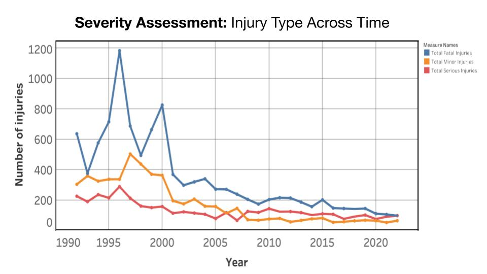
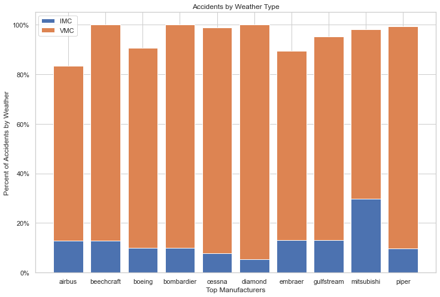
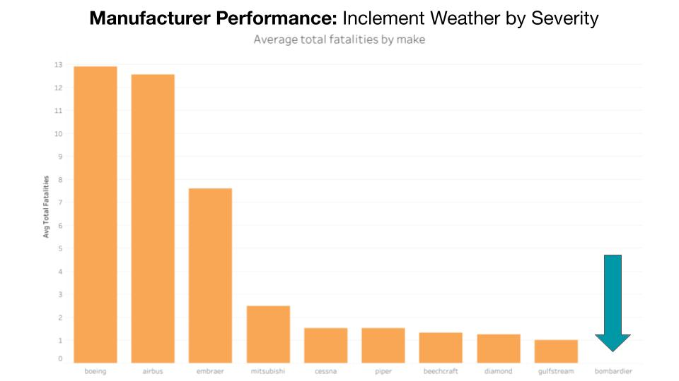

    

# Risk Analysis: HDK & Co. New Aviation Division

## Overview

We analyzed risk factors involved with HDK % Co. starting a new aviation division.  Selecting the aircrafts with the least amount of risk involves many factors.  The accident data that we studied allowed us to focus on some of these, including different aircraft manufacturers, the type of airplane build, and weather conditions.

    

## Business Problem

We set out to determine the lowest risk airplanes in inclement weather.

While aircraft safety has made significant improvements in recent decades, the number of fatalities are greater, on average, for accidents in inclement weather than in clear weather.  As the climate continues to change and weather conditions become more severe, reducing risk in such circumstances will become more important over time.

## Data Understanding and Analysis

For our data, we looked at NTSB aviation accident records from 1962 to 2023.  Our dataset started with about 89,000 accident records from US and foreign flights.  We narrowed down those records to accidents occurring in the last 30 years and involving professionally built airplanes from the top 10 manufacturers.  The records that we focused on most specifically from that group included weather conditions during accidents and the severity of injuries incurred from the accidents.

There were some limitations to the data, however.  We did not know the total number of flights that did not involve some type of incident, and we did not have information about total passengers on flights.  There was also some data that was ambiguous or missing that could affect the analysis.

Some of the key takeaways are shown in the following graphs:

Accidents involving injuries, especially fatalities, have been decreasing over the last 30 years.

    

 
 

    

 
 

    

## Conclusion

This analysis leads to three recommendations for HDK & Co. to consider to minimize risk of the aircrafts in its new aviation division.

- **Choose a professionally built aircraft from one of our top manufacturers.** Professionally built aircraft safety is improving at a much higher rate than amateur built aircrafts. Additionally, the injury severity for professional built aircrafts is lower than amateur builds. Although amateur builds may be less expensive, it is not the safest option.

- **Bombardier is the best manufacturer option.**
Bombardier had zero accidents with fatalities in inclement weather over the last 30 years.

- **Diamond and Cessna are great alternative manufacturer options.**
Diamond had the lowest percentage of its accidents that occurred during poor weather conditions. Cessna also had a low percentage of accidents in bad weather along with far more data supporting that result.

## Future Considerations

Further analysis is required to improve risk assessment and gain beneficial insights: 

- Expand the analysis with more data like total numbers of flights and passengers
- Analyze location data to identify favorable air routes and airports
- Study economic data, including costs of aircrafts from the recommended manufacturers
- Implement FRAT (Flight risk assessment tool) for pilots

## Appendix

The complete analysis can be found in the <a href="aviation_division_FINAL.ipynb">Jupyter Notebook</a> and in our <a href="presentation.pdf">presentation</a>.

To view the interactive visuals, please see the <a href="https://public.tableau.com/app/profile/harshitha.thota/viz/AviationRiskAnalysis/Dashboard1">dashboard</a>.

For technical questions, please contact Kari Primiano at <a href="mailto:kkprim@gmail.com">kkprim@gmail.com</a>.
 
For presentation or visualizations questions, please contact Harshitha Thota at <a href="mailto:harshitha.thota@gmail.com">harshitha.thota@gmail.com</a>.
 
For general questions, please contact Dan Rosen at <a href="mailto:dan_rosen@outlook.com">dan_rosen@outlook.com</a>.

**Sources**

<a href="https://www.airbus.com/en/products-services/commercial-aircraft/the-life-cycle-of-an-aircraft/operating-life">30 years for airplane lifetime</a>
 
<a href="https://assetsamerica.com/aircraft-manufacturers/">Top 10 airplane manufacturers</a>
 
<a href="https://www.faa.gov/about/history/brief_history">1950's air safety standards</a>
 
<a href="https://medium.com/faa/introduction-to-safety-risk-management-8e1b1ac15b4c">FRAT tools</a>

## Repository Structure

  - Data
  - Images
  - README.md
  - aviation_division.ipynb
  - aviation_risk_presentation.pdf

